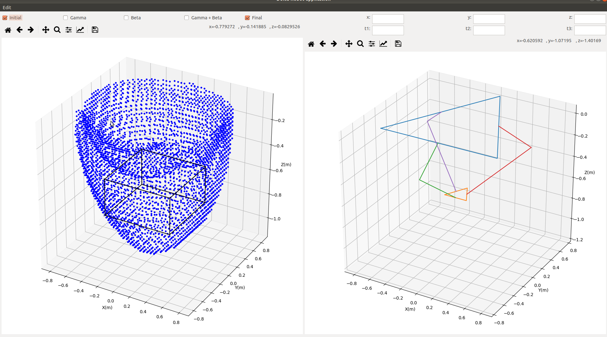

# Introduction
This project is a python desktop application developped using pyqt4 to visualize the different configurations that 3 axis delta robot can take. In addition it gives a small preview of the work volume of the robot (accessible points in during operation in 3D)

---

# Dependecies
The dependencies can be installed by running the setup.sh script  as follows
```
chmod +X setup.sh
./setup.sh
```

# Running the app

```
python3 main\ Application.py
```

# Functionnality


### Main function
The left area is the area where the work volume of the robot is displayed. By hovering the mouse over this area the position at the top right of the window changes, after getting the desired position in 3d, a click on the mouse will update the values of the edit boxes on the top right of the application and update the corresponding angles of the robot if they exist. In addition, the configuration of the robot on the right changes so that the end effector of the robot matches the clicked position.

### Work volume limitations
Some positions in the mathematical work volume of the robot may not be accessible due to its mechanical structure, which sometimes limits the angles that can be reached between the arms of the robot and its forearms. By considering gamma the angle between the arm and the projection of the forearm to the vertical plane passing by the arm, checking the gamma checkbox at the top of the app would visualize the reduced volume caused by the limitation on the gamma angle.
In addition, by considering beta the angle between the projection of the arms and the projection of the forearms to the horizontal plane passing by the intersection (arm x forearm), checking the corresponding box would visualize the effect of such a limitation.
Finall the gamma+beta checkbox will visualize the combination of the aforementioned limitaitons.
The final volume of operation that can be chosen for the robot can be seen in balck and appears when the "final" checkbox is checked.

### Changing the robot dimensions
The diomensions of the robot:
- Size of the base
- Length of the arms
- Length of the forearms
- Size of the end effector
All can be changed by clicking on edit -> delta parameters.
The work volume is automaticcaly updated after changing these values.
